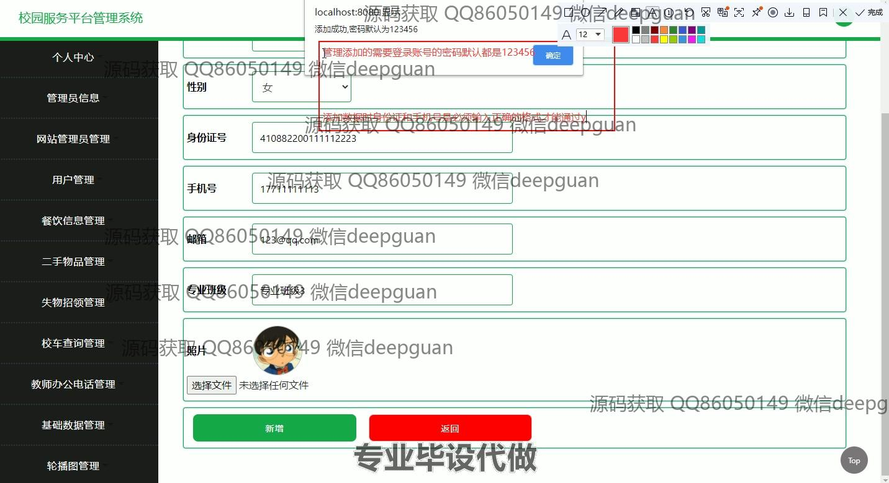

<h1 align="center">校园服务平台管理系统</h1>

## 简介
校园服务平台管理系统：角色分为管理员、用户；功能包括用户管理、餐饮信息管理、失物招领、校车查询管理、教师信息查询及新闻管理。系统提高校园内服务的便利性和效率。    --计算机毕业设计源码；毕设源码；java毕业设计源码

## 联系方式

<h3 align="center">获取完整代码与数据库文件 + 微信：deepguan QQ: 86050149 QQ群: 783742310</h3>

<h3 align="center">可帮忙远程部署 包运行成功！提供远程部署、修改代码、设计文档指导、代码讲解等服务！</h3>

## 功能介绍（完整见运行截图）
管理员：基本功能包括登录和注册，还能进行网站首页的管理，管理界面包括首页、教师办公室电话、餐饮信息、二手物品、新闻、失物招领、校车查询等模块。管理员可以编辑网站管理员信息、管理用户及其信息、添加或修改新闻及公告、处理二手物品交易、调整课程及活动安排以及管理校园公告。个人中心允许编辑个人信息、修改密码和上传照片。此系统提供了后台管理功能以便管理员高效管理校内资源和服务。

用户：用户可以通过系统进行登录和注册，管理个人信息和密码。个人中心允许查看和编辑个人资料，包括姓名、性别、身份证号、手机号、邮箱等信息，还可以上传个人照片。用户模块提供多种功能：查询和查看课程安排、新闻及校园公告、二手物品信息、教师信息等。用户还可以通过平台使用和参与餐饮信息管理、失物招领、校车查询等校园服务，提升校园内个人生活和学习便利性。

## 运行截图

本代码来源于网络,仅供学习参考使用!

